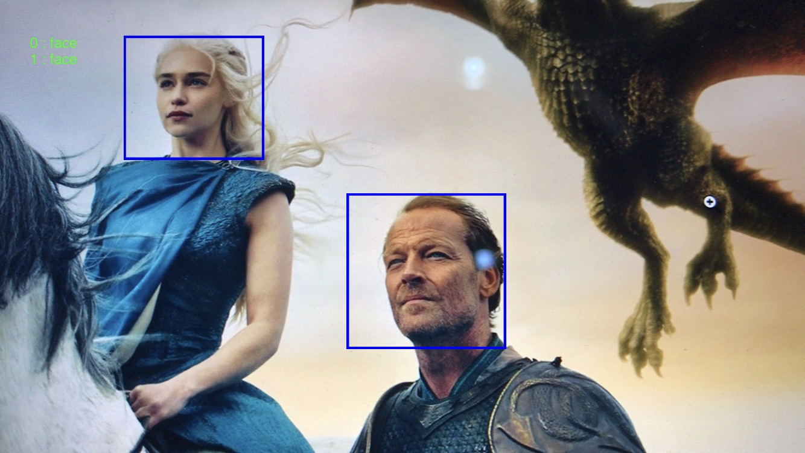

# Slack Channel for Deep Learning Communication:

```
https://deep-learning-geeks-slack.herokuapp.com/
```


# Tensorflow-Yolo-iOS


# Dependencies

[Tensorflow 1.1.0](https://github.com/tensorflow/tensorflow/tree/v1.1.0)

[Swift 3](https://swift.org/blog/swift-3-0-released/)

[DeepBelief](https://github.com/jetpacapp/DeepBeliefSDK)

[Git LFS](https://git-lfs.github.com/)


# Note

1. This repo is build and modifided based on [enVision](https://github.com/IDLabs-Gate/enVision), which is built with tensorflow < 1.* ;

2. Since, there's a quite big dependencies folder with tensorflow v1.1.0 static built and re-organization, we used [Git LFS](https://git-lfs.github.com/) to store all the big files. It means, when you try to build this project locally, make sure you have git lfs installed and fetch all codes ;

Do following:

```
brew install git-lfs
git lfs install
git lfs clone https://github.com/KleinYuan/tensorflow-yolo-ios
```

3. A frozen tiny-yolo tensorflow model is provided by default, with VOC data trained. If you want to do an end-to-end (meaning, train yolo on darknet -> translate -> freeze model -> implement on iOS), you may need [this](https://github.com/thtrieu/darkflow)

---------------------------------------

## About this fork
This fork is to make the project work on yolo-face model


